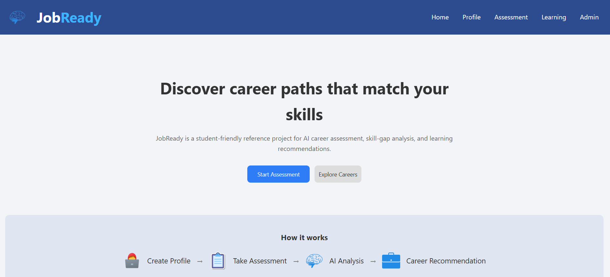
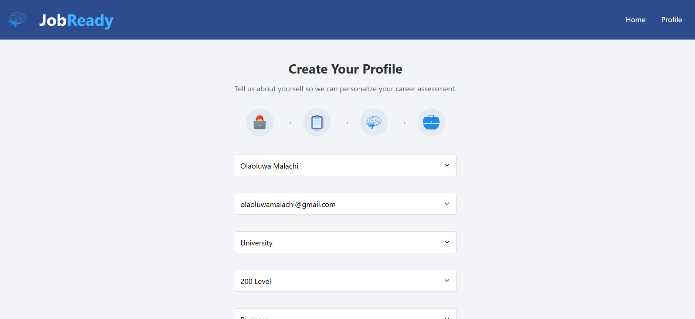
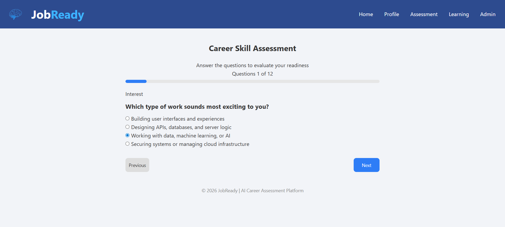
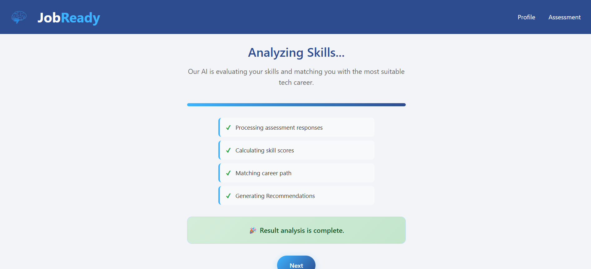
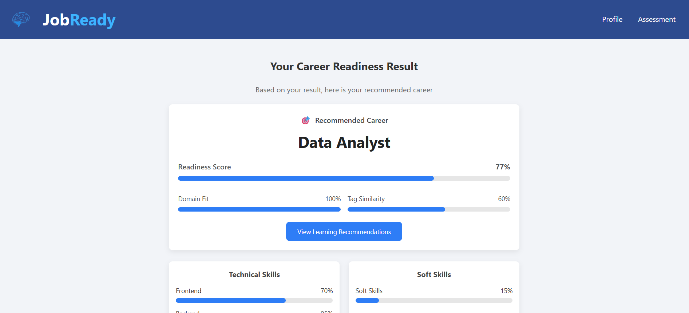
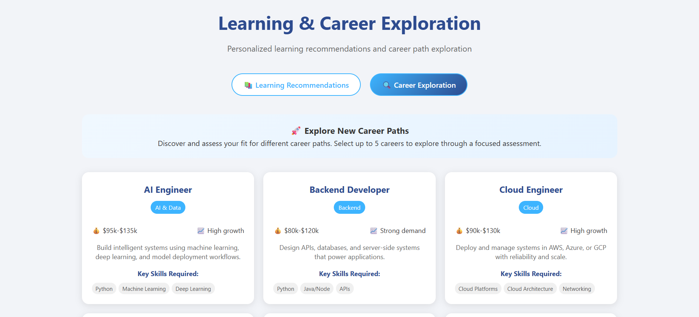

# JobReady – AI Career Assessment Platform

## Overview

JobReady is an AI-powered career assessment platform that helps students:
- Discover suitable tech careers
- Identify skill gaps
- Receive learning recommendations

---

## What This Project Teaches

This project demonstrates:
- frontend + backend integration
- rule-based AI logic
- user journey design
- extendable system architecture

---

## Project Structure

```
jobready_reference_project/
│
├── app/
├── templates/
├── static/
├── data/
├── requirements.txt
├── README.md
├── STUDENT_HIGHLIGHTS.md
└── screenshots/
    ├── home.png
    ├── profile.png
    ├── assessment.png
    ├── analyse.png
    ├── career.png
    ├── recommendations.png
    └── results.png
```
---

## Setup Instructions (Windows)

```powershell
git clone https://github.com/Malachi216/jobready_reference_project.git
cd jobready_reference_project
python -m venv .venv
.\.venv\Scripts\activate
pip install -r requirements.txt
python -m uvicorn app.main:app --host 127.0.0.1 --port 8010
start http://127.0.0.1:8010
```

---

## Application Flow

Home → Profile → Assessment → Analysis → Career → Learning → Admin

---

## ⚠️ Common Issues

### Port Error
Use port 8010 instead of 8000

### Template Error
Use:
templates.TemplateResponse(request, "file.html", {})

### Nested Folder Issue
Ensure no double folder nesting after unzip

---

## 📸 Screenshots

## Screenshots

### Home


### Profile Setup


### Assessment Flow


### AI Analysis Screen


### Results


### Learning Recommendations


### Career Recommendation 



---

## Student Roles

### AI & Data Students
- Improve recommendation logic
- Build ML model

### Backend Engineers
- Improve API + database

### Frontend Engineers
- Improve UI/UX

---

## Extensions

- AI interview system
- CV scoring
- authentication
- deployment

---

## Note

This project simulates a real AI product and is designed for learning, extension, and portfolio use.
